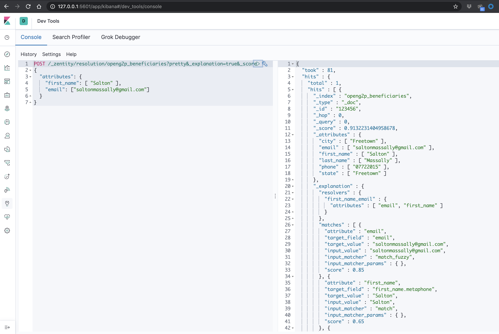

# Getting started

Provides a Rest API for persons/beneficiaries data to be indexed and queried. A typical use case will:

1. index all enrolled beneficiaries into the deduplication service
2. query the deduplication service to assert that an applicant is not already enrolled before proceeding
3. use for deduplicating existing beneficiary lists

## API

### Indexing Beneficiary

Adding a beneficiary to the deduplication service, e.g., beneficiary add to your program

```bash
POST /index
{
    "city": "Freetown",
    "email": "saltonmassally@gmail.com",
    "first_name": "Salton",
    "id": "{id}",
    "last_name": "Massally",
    "phone": "07722015",
    "state": "Freetown",
    "street": "5 Foday Drive",
    "street2": "Hill Station"
}
```

> **NOTE** `id` must be unique, ideally beneficiary ID in your database. This is what is returned for matches.

### Searching for Beneficiary

Checks indexed beneficiaries for similar matches

```bash
POST /index/search
{
  "attributes": {
    "first_name": "Salton",
    "last_name": "Massally",
    "phone": ["202-555-1234", "317-555-1234"],
    "email": "saltonmassally@gmail.com"
  }
}
```

```bash
RESPONSE: HTTP 200

[
    {
        "beneficiary": "{id}",
        "reasons": [
            "email ->  Input: saltonmassally@gmail.com | Match: saltonmassally@gmail.com | Type: match_fuzzy ",
            "first_name.metaphone ->  Input: Salton | Match: Salton | Type: match ",
            "first_name.nysiis ->  Input: Salton | Match: Salton | Type: match ",
            "first_name.soundex ->  Input: Salton | Match: Salton | Type: match ",
            "first_name ->  Input: Salton | Match: Salton | Type: match_fuzzy ",
            "last_name.metaphone ->  Input: Massally | Match: Massally | Type: match ",
            "last_name.nysiis ->  Input: Massally | Match: Massally | Type: match ",
            "last_name.soundex ->  Input: Massally | Match: Massally | Type: match ",
            "last_name ->  Input: Massally | Match: Massally | Type: match_fuzzy "
        ]
    }
]
```

Returns a list of map of beneficiaries with the id used to index the record and a list of reasons why the
record matched the query.

```
> Performance of queries depend on data quality of both the index and they query
>
> Querying with as much data as possible increases the likelihood of finding duplicates if any exists.
{: .important}
```

> Not finding a duplicate is not a certainty that none exist.
>
> Especially if unique IDs are lacking or multiple IDs are supported, the frameworks approach to deduplication
> is probabilistic and depends on factors like data quality, and matching strategies employed (e.g. biometric
> provides greater assurances than entity resolution). Inversely, matching a duplicate simply means that there
> is a high probability that they both refer to the same person (usually > 95% if data quality is ideal) and
> not that its a certain match. Consequently some human intervention is necessary. {: .important}

### De-indexing Beneficiary

Removing a beneficiary from the deduplication service, e.g., beneficiary disenrolled from your program

```bash
DELETE /index/{id}
```

Where `id` is what was used to index beneficiary

## Allowed fields

Table shows a list of beneficiary attributes allowed for indexing and querying:

| Attribute               | Type   | Note                                                                 |
| ----------------------- | ------ | -------------------------------------------------------------------- |
| id                      | String | Required; beneficiary's unique ID in your database                   |
| identity                | String | Identity records in the form **type-number**. e.g. passport-1234567  |
| first_name              | String |                                                                      |
| middle_name             | String |                                                                      |
| last_name               | String |                                                                      |
| phone                   | String | Please remove the country code e.g. 0778763839 and not +232778763839 |
| email                   | String |                                                                      |
| street                  | String |                                                                      |
| street2                 | String |                                                                      |
| city                    | String | City or town depending on context                                    |
| state                   | String | State or District depending on context                               |
| postal_code             | String |                                                                      |
| dob                     | String | please use form 1990/07/23                                           |
| bank                    | String | Name of bank or any organization that payment is sent to             |
| bank_account            | String | Bank account number                                                  |
| emergency_contact_name  | String | Name of person listed as emergency contact                           |
| emergency_contact_phone | String | Phone of person listed as emergency contact; without country code    |

You do not need to provide all this data when indexing or querying for records; however the better your data
quality, the better the precision of your result; i.e. try to supply all these fields for both index and query
operations!

## Kibana UI

The docker-compose ships with Kibana, providing the power to visualize your beneficiary data in custom ways
and run queries against the elasticsearch backend.

**Navigate to `http://<you-ip-address>:5601`**



## How it all works

The default implementation works via the process of entity resolution. It compares attributes of the query
provided against its database of indexed beneficiaries to find a match very likely referencing the same
person.

Below is the set of matching rules employed:

- identity (ID Type Number)
- first_name, last_name, phone
- first_name, phone
- first_name, last_name, phone
- last_name, phone
- first_name, last_name, email
- first_name, phone
- last_name, phone
- first_name, last_name, middle_name, dob
- first_name, last_name, street, street2, city, state
- first_name, last_name, street, city, state
- first_name, last_name, street, state
- first_name, last_name, middle_name, street2, state
- first_name, last_name, street, postal_code
- first_name, last_name, dob, city, state
- first_name, last_name, emergency_contact_phone
- first_name, last_name, middle_name, emergency_contact_name
- first_name, last_name, bank_account_bank, bank_account_number
- first_name, bank_account_bank, bank_account_number
- last_name, bank_account_bank, bank_account_number

> **_NOTE:_** To compensate for typos and near infinite representation of the same information, we employ a
> selection of fuzzy matching and phonetics algorithms when indexing and querying
